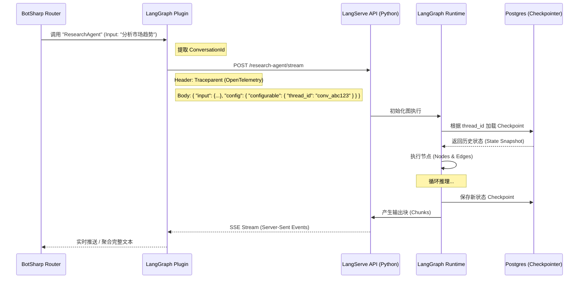

# BotSharp 与 LangGraph 集成快速入门

## 概述

BotSharp 与 LangGraph 的集成跨越了语言边界（C# 到 Python）。LangGraph 的核心价值在于其状态管理和循环推理，因此集成的关键在于**状态映射（State Mapping）**和**持久化（Persistence）**。

## 5.1 通信协议规范：LangServe REST API

LangServe 提供了一套标准化的 REST API。

### API 端点

- `/invoke`: 同步调用，等待结果。
- `/stream`: 流式返回，适合长文本生成。
- `/batch`: 批量处理。

### 输入 Schema

LangServe 会根据定义的 Python Runnables 自动生成 OpenAPI 文档。通常输入格式为：

```json
{
  "input": {
    "messages": [...]
  }
}
```

### 状态控制（State Control）

这是集成的核心。LangGraph 使用 `thread_id` 来隔离不同用户的会话状态。

## 5.2 状态管理策略：会话 ID 映射

BotSharp 拥有自己的 `ConversationId`。为了让 LangGraph 能够"记住"之前的交互，BotSharp 必须将自身的 `ConversationId` 传递给 LangGraph。

### 映射逻辑

BotSharp 在调用 LangServe 时，必须在请求体的 `config` 字段中注入 `configurable` 字典。

### 请求 Payload 示例（BotSharp -> LangServe）

```json
{
  "input": {
    "messages": [
      { "type": "human", "content": "分析这份财务报表的数据趋势" }
    ]
  },
  "config": {
    "configurable": {
      "thread_id": "botsharp_conversation_Guid_Value"
    }
  }
}
```

### 深度洞察

通过这种 1:1 的 ID 映射，LangGraph 的 checkpointer（如 Postgres 或 Redis）实际上成为了 BotSharp 的"外挂海马体"。即使用户在 BotSharp 中切换了 Agent，只要再次切回 LangGraph Agent 并带上相同的 ID，LangGraph 就能无缝恢复之前的推理上下文。

## 5.3 序列图：BotSharp 调用 LangGraph（含状态持久化）



## 5.4 处理"人机回环"（Human-in-the-loop）

LangGraph 支持 `interrupt`（中断）机制，用于请求人类确认。

### 中断处理流程

1. **检测中断**：如果 LangServe 返回的状态为 `interrupted` 或包含 `__interrupt__` 字段，BotSharp 插件必须捕获此状态。

2. **挂起会话**：BotSharp 暂停当前流，向用户发送请求确认的消息（例如："LangGraph需要您批准执行下一步操作，是否继续？"）。

3. **恢复执行**：当用户回复"是"时，BotSharp 再次向 LangServe 发送请求，这次使用 Command 模式或更新状态来恢复（Resume）执行，依然携带相同的 `thread_id`。

### 中断处理示例

```json
{
  "status": "interrupted",
  "__interrupt__": {
    "type": "approval_required",
    "message": "需要确认执行下一步操作"
  }
}
```

恢复执行时的请求：

```json
{
  "input": {
    "messages": [
      { "type": "human", "content": "是，继续执行" }
    ]
  },
  "config": {
    "configurable": {
      "thread_id": "botsharp_conversation_Guid_Value"
    }
  }
}
```

## 配置示例

在 BotSharp 配置文件中添加 LangGraph 插件配置：

```json
{
  "LangGraph": {
    "BaseUrl": "http://localhost:8000",
    "ApiKey": "your-api-key",
    "Timeout": 300,
    "EnableTracing": true
  }
}
```

## 使用示例

1. 确保 LangServe 服务已启动
2. 配置 BotSharp 的 LangGraph 插件
3. 创建或使用一个 LangGraph Agent
4. 通过 BotSharp 发送消息给 Agent
5. LangGraph 会自动管理会话状态并执行循环推理

## 关键特性

- ✅ **状态持久化**：通过 thread_id 映射实现跨会话的状态保持
- ✅ **流式响应**：支持实时返回长文本生成结果
- ✅ **人机回环**：支持中断和恢复机制
- ✅ **分布式追踪**：通过 OpenTelemetry 集成实现请求追踪
- ✅ **批量处理**：支持批量请求处理

## 故障排查

### 连接失败

检查 LangServe 服务是否正在运行：

```bash
curl http://localhost:8000/health
```

### 状态丢失

确保 LangGraph 配置了正确的 checkpointer（如 Postgres 或 Redis）。

### 超时问题

对于长时间运行的任务，增加配置中的 `Timeout` 值。
